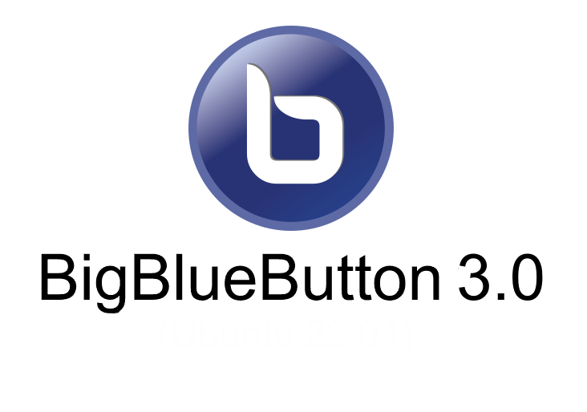

# BigBlueButton v3.x ve Ötesi — Kurumsal BT Altyapı ve Mimarisi 2026



```console
## Yazar: faruk-guler 2026
```
## BigBlueButton (BBB) Nedir?
BigBlueButton, özellikle uzaktan eğitim (e-learning) ve sanal sınıflar için tasarlanmış bağımsız, açık kaynaklı bir web konferans sistemidir. Sadece video konferans yapmakla kalmaz; beyaz tahta (whiteboard), breakout odaları (kırılım odaları), anketler ve ekran paylaşımı gibi eğitime yönelik araçları varsayılan olarak sunar. Öğrencilerin veya katılımcıların herhangi bir program indirmesine gerek kalmadan doğrudan tarayıcı (HTML5) üzerinden toplantılara katılmasını sağlar.

Bu proje, **BigBlueButton (BBB)** için sistem yöneticilerine, devops mühendislerine ve sunucu yöneticilerine yönelik hazırlanan, baştan uca ve eksiksiz bir Türkçe dokümantasyon setidir. Dokümantasyon, BBB'nin güncel kararlı sürümü olan **v3.0.22** (Mart 2026) odaklı hazırlanmıştır. Greenlight ön yüz sürümü **3.5**'tir.

## Dokümantasyon Hakkında 📘
Bu repo altındaki dosyalar, BigBlueButton v3.0 mimarisi için tam bir SysAdmin rehberidir. Kurulumdan optimizasyona, sorun gidermeden yük dengelemeye kadar geniş bir yelpazeyi kapsar. Geleneksel "next-next" kurulum kılavuzlarından farklı olarak, arka plandaki servislerin haberleşmesini, portların görevlerini ve günlük yönetimde karşılaşılacak gerçek senaryoları ele alır.

### Öne Çıkan Başlıklar:
* **Mimari ve İşleyiş Deşifresi:** Neden Mediasoup? Redis ve MongoDB o toplantıyı nasıl ayakta tutuyor?
* **Gerçek Dünya Kurulumları:** NAT Arkası zorlukları, UFW Firewall yönetimi ve TURN (Coturn) sunucusu entegrasyonu.
* **Troubleshooting (Sorun Giderme):** 1007, 1020 numaralı meşhur WebRTC Hatalarının kalıcı çözümleri ve Prometheus & Grafana ile anlık izleme teknikleri.
* **Kriz Yönetimi ve Kritik Hatalar:** Sunucu çökmesi (502 Gateway), kırık ofis sunumları (LibreOffice), veritabanı taşıma (pg_dump) ve TLS yenileme krizlerine acil müdahale rehberi.
* **Yük Dengeleme (Scalelite/Greenlight LB):** Odaların birbirinden izole sunuculara otomatik nasıl dağıtılacağı (Cluster senaryoları) ve ortak NFS kayıt depolaması.
* **İleri Düzey Entegrasyonlar:** REST API Checksum mantığı (LMS Bağlantıları), Webhooks, Greenlight v3 (LDAP/OAuth) ve FreeSWITCH SIP Trunk (Telefon ile katılım) mimarisi.
* **BBB 3.0 Yenilikleri:** TLDraw entegrasyonu, Sanal Arka Planlar, **Plugin Architecture** (App Gallery), Greenlight 3.5 ve rol Yol Haritası (4.0/Ubuntu 24.04).
* **Öğrenme Analitikleri ve Frontend:** Öğrenme gösterge paneli (Learning Dashboard) yönetimi ve arayüz dosyalarına (JSON locale çevirileri) sistem yöneticisi seviyesinde müdahale teknikleri.

## Kimler İçin?
1. **2026 Yılı Standartlarında** yeni nesil BigBlueButton v3.x altyapısı kurmak veya eski (2.x) sürümleri kalıcı olarak terk etmek isteyenler.
2. Mevcut BBB altyapısını kendi kurumsal renkleri ve logosu ile markalaştırmak (Branding) isteyenler.
3. Öğrencilerin kameralarının açılmaması, sesin zayıf gelmesi gibi teknik darboğazları teşhis etmek isteyen ağ ve sistem yöneticileri.

> **💡 İpucu:** `bbb-conf` komutu bu sistemin kalbidir. Sistemin durumunu hızlıca analiz etmek için her zaman `sudo bbb-conf --status` veya `sudo bbb-conf --check` komutlarını kullanabilirsiniz.

---
